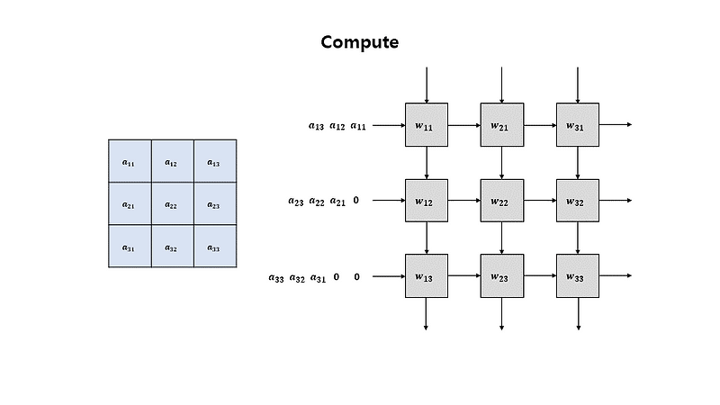

# Systolic Arrays

This repository presents a **minimal, first‐principles** introduction to systolic arrays and demonstrates how they power modern deep‐learning hardware. We also provide a simple Python implementation to showcase these concepts.

---

## Updates
07/01/25: Highly recommend readers to refer to the [TPU Deep Dive blog post](https://henryhmko.github.io/posts/tpu/tpu.html) for an in-depth introduction to TPUs

---

## What Is a Systolic Array?

A systolic (from the medical term for pulsing) array is a grid of simple Processing Elements (PEs) that rhythmically compute and pass data to their neighbors. Each PE holds two registers: `a` (weight) and `b` (activation), as well as an accumulator (`sum`):

- **Weight‑Stationary Flow**: Preload each PE's `a` register with one weight element. Then, stream activations in from the west.  
  Each cycle: multiply the _fixed_ weight by the incoming activation, accumulate into `sum`, and forward the activation east.  
  After `M + N + K - 2` cycles, each `sum` register holds the dot product of its weight row and activation column.

<div align="center">
  
</div>

**Figure 1: Weight‑stationary systolic array dataflow**

This **1‑MAC per PE per cycle** pipeline maximizes throughput with local data reuse.

**Other Mapping Variants**
- **Input‑Stationary**: Each PE holds a fixed activation value and streams weights through to maximize activation reuse.
- **Output‑Stationary**: Each PE retains its running sum locally, streaming both weights and activations until the full dot‑product is computed and then outputs the result.

---

## Why It Matters for Deep Learning

### Fully‑Connected Layers (GEMM)
A dense (fully‑connected) layer computes:

$$
  y = W \, x
$$

$$
  y_i = \sum_k W_{i,k} \, x_k
$$

A 2-D systolic array pipelines rows of $W$ and elements of $x$ through the PEs, achieving one MAC per PE per cycle with local data reuse.

### Convolutional Layers
A systolic array can also accelerate convolutions by lowering them (e.g. via **im2col**) into a standard GEMM, reusing the same dataflow for sliding-window dot products.

### Real‑World Accelerators
- **Google TPU**  
  TPU cores use a large 2D systolic array (MXU) for high‑throughput matrix multiplies.

- **NVIDIA Tensor Cores**  
  Volta-and-later GPUs implement systolic‑inspired pipelines in tensor cores for mixed‑precision GEMMs.

- **Mobile NPUs**  
  Some on‑device NPUs integrate systolic arrays (e.g. Apple Neural Engine, Huawei Ascend), while others (e.g. Qualcomm Snapdragon NPU) rely on flexible vector/SIMD engines or DSPs rather than systolic arrays.

---

## Python Reference Implementation

Below is the signature and core loop of `SystolicArray:run()`:

```python
def run():
    """
    Multiply self.A (M x K) by self.B (K x N) using a systolic dataflow.
    Returns C (M x N).
    """
    # ... core loop feeds, MAC, shifts ...
    return C, total_cycles_run
```

_See the full implementation in [`systolic_array.py`](./systolic_array.py)._

---

## Getting Started

1. **Clone** this repo.
2. **Run** the demo:
   ```bash
   python systolic_array.py
   ```
3. **Inspect** `SystolicArray:run()` to see how weights and activations pipeline through PEs.

---

## Technical Terms Glossary

- **MAC (Multiply-Accumulate)**: A **MAC** operation is a fundamental computation in deep learning where two numbers are multiplied and the result is added to a running total. It’s commonly used in matrix multiplication and other operations in neural networks.
  
- **GEMM (General Matrix Multiply)**: **GEMM** refers to the operation of multiplying two matrices and adding the result to a third matrix (optional). In deep learning, it’s often used in fully-connected layers or for matrix-based operations like convolution.

- **PE (Processing Element)**: A **PE** is a basic computational unit in a hardware accelerator (like a systolic array). It performs simple operations such as multiplication or addition.

- **Systolic Array**: A **systolic array** is a network of processing elements (PEs) arranged in a grid, where each PE performs computations and passes data to its neighbors. This structure is particularly efficient for parallel computing tasks like matrix multiplication.

- **Weight-Stationary Flow**: In **weight-stationary flow**, each PE stores a fixed weight value and processes incoming activations, multiplying the fixed weight by the activation during each cycle of computation.

---

## Further Reading

- **Systolic Array** [Wikipedia](https://en.wikipedia.org/wiki/Systolic_array)

  A brief overview of the idea and its history.

- **Understanding Matrix Multiplication on a Weight-Stationary Systolic Architecture** [blog](https://telesens.co/2018/07/30/systolic-architectures/)

  - A visual walkthrough of how systolic arrays perform matrix multiplication, with a focus on the weight-stationary dataflow used in deep learning accelerators.

- **(TPUv1) In-Datacenter Performance Analysis of a Tensor Processing Unit**, Jouppi et al., ISCA 2017 [arXiv](https://arxiv.org/abs/1704.04760)
  
  The seminal Google TPU paper -- industrial-scale systolic array in practice.

- **Efficient Processing of Deep Neural Networks: A Tutorial and Survey**, Sze et al., IEEE 2017 [arXiv](https://arxiv.org/abs/1703.09039)
   
   A thorough survey covering memory hierarchies, dataflows, and precision trade‑offs.

---
